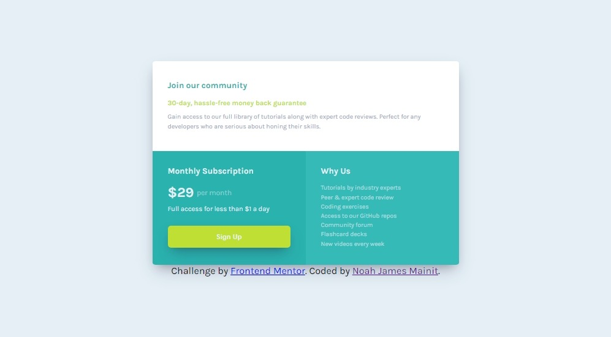

# Frontend Mentor - Single price grid component solution

This is a solution to the [Single price grid component challenge on Frontend Mentor](https://www.frontendmentor.io/challenges/single-price-grid-component-5ce41129d0ff452fec5abbbc). Frontend Mentor challenges help you improve your coding skills by building realistic projects. 

## Table of contents

- [Overview](#overview)
  - [The challenge](#the-challenge)
  - [Screenshot](#screenshot)
  - [Links](#links)
- [My process](#my-process)
  - [Built with](#built-with)
  - [What I'm doing](#what-i'm-doing)
- [Author](#author)

**Note: Delete this note and update the table of contents based on what sections you keep.**

## Overview

### The challenge

Users should be able to:

- View the optimal layout for the component depending on their device's screen size
- See a hover state on desktop for the Sign Up call-to-action

### Screenshot

- **MOBILE RESPONSIVE**

- **DESKTOP RESPONSIVE**

### Links

- Solution URL: [Add solution URL here](https://www.frontendmentor.io/solutions/single-price-grid-component-vgT8G-KWYn)
- Live Site URL: [Add live site URL here](https://heion31.github.io/Single-Price-Grid-Component/)

## My process

### Built with

- Semantic HTML5 tags
- CSS Grid
- CSS Variable
- Mobile-first workflow
- BEM Syntax
- Media Queries

### What I'm doing

I create this simple project to practice the BEM naming convention and CSS Grid.

## Author

- Frontend Mentor - [@heion31](https://www.frontendmentor.io/heion31/yourusername)
- Twitter - [@heion31](https://www.twitter.com/heion31)

